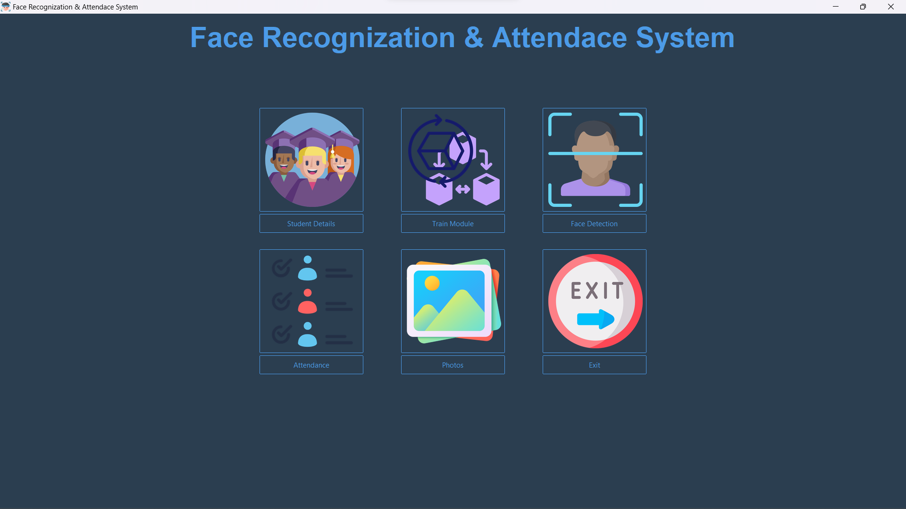

## Face Recognition & Student Attendance System

Developed using Python Tkinter and MySQL, this Face Recognition & Student Attendance System offers a seamless way to manage attendance through facial recognition technology.

**Key Features:**
- Utilizes facial recognition for student attendance
- Stores attendance data in a MySQL database
- Simple and intuitive user interface with Tkinter

Effortlessly track student attendance and streamline the process with this user-friendly system.

### How to Use
1. Clone the repository or download the files.
2. Ensure Python, Tkinter, and MySQL are installed.
3. Run the main.py file.

Enhance attendance management with the power of facial recognition using this system!
