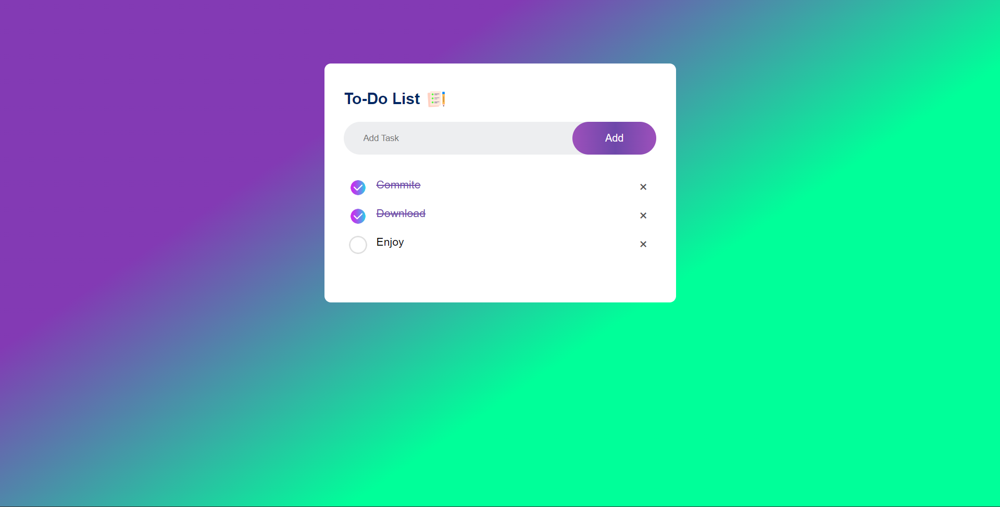

## To-Do List App

A straightforward and intuitive To-Do List App created with HTML, CSS, and JavaScript. Keep track of your tasks and stay organized with ease.

**Key Features:**
- Add, edit, and remove tasks
- Clean and responsive design

Effortlessly manage your daily tasks and boost your productivity.

### How to Use
1. Clone the repository or download the files.
2. Open `index.html` in your web browser.
3. Start adding and managing your to-do tasks.

Simplify your life and stay on top of your responsibilities with the To-Do List App!
