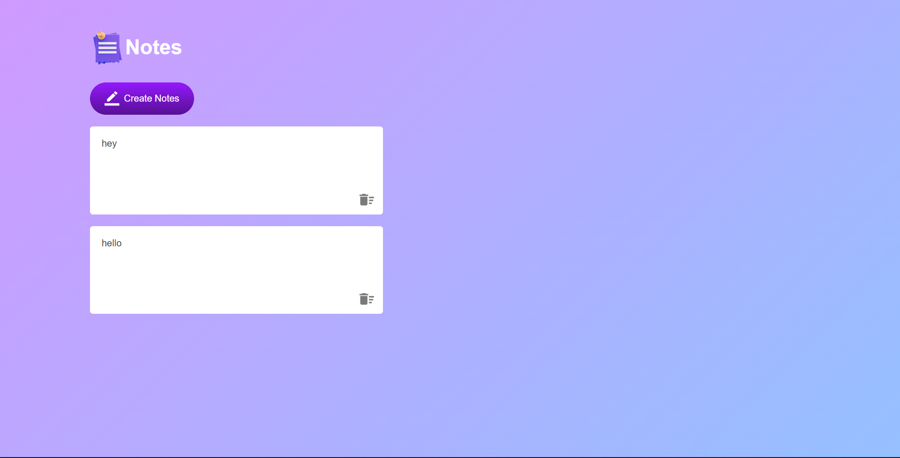

## Notes App

Stay organized and jot down notes effortlessly with this Notes App created using HTML, CSS, and JavaScript.

**Key Features:**
- Create, edit, and delete notes
- User-friendly interface for quick note-taking
- Access your notes anytime, anywhere

Simplify your note-taking and never forget an idea or task again.

### How to Use
1. Clone the repository or download the files.
2. Open `index.html` in your web browser.
3. Start adding and managing your notes.

Boost your productivity with the Notes App!
