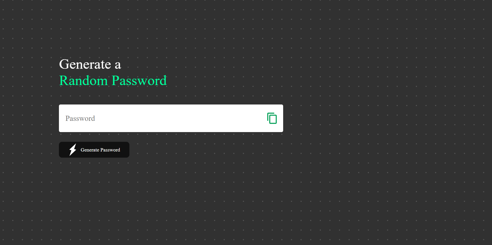

## Random Password Generator

Create strong and unique passwords with ease using this Random Password Generator built with HTML, CSS, and JavaScript. 

**Key Features:**
- Generate random, secure passwords on-the-fly
- User-friendly, no-frills design

Say goodbye to weak passwords and boost your online security with this handy tool.

### How to Use
1. Clone the repository or download the files.
2. Open `index.html` in your web browser.
3. Click "Generate Password" and copy your new password.

Enhance your online security effortlessly with the Random Password Generator!
