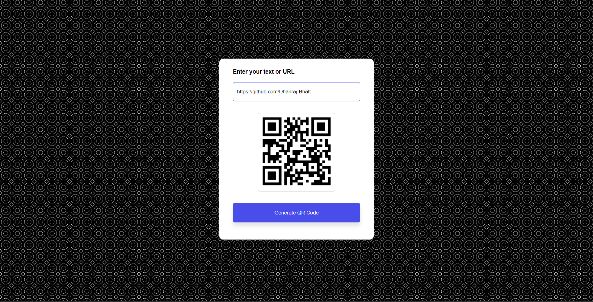

## QR Code Generator

Easily create QR codes for web links, text with this QR Code Generator. Developed using HTML, CSS, and JavaScript, it's a straightforward tool for generating QR codes on the fly.

**Key Features:**
- Generate QR codes for URLs, text
- Quick and intuitive user interface

Simplify QR code creation and share information effortlessly.

### How to Use
1. Clone the repository or download the files.
2. Open `index.html` in your web browser.
3. Input your content, and click "Generate QR Code"

Share information conveniently with the QR Code Generator!
