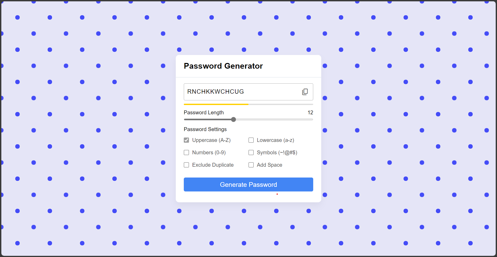

## Random Password Generator

Generate strong and secure passwords effortlessly with this Random Password Generator. Built with HTML, CSS, and JavaScript, this lightweight tool lets you create custom passwords with ease.

**Key Features:**
- Customizable password length and character types
- Instantly generate unique and secure passwords
- Simple and intuitive user interface

Boost your online security with strong, randomized passwords.

### How to Use
1. Clone the repository or download the files.
2. Open `index.html` in your web browser.
3. Adjust the settings, click "Generate Password" and copy your new password.

Safeguard your accounts with the Random Password Generator!
